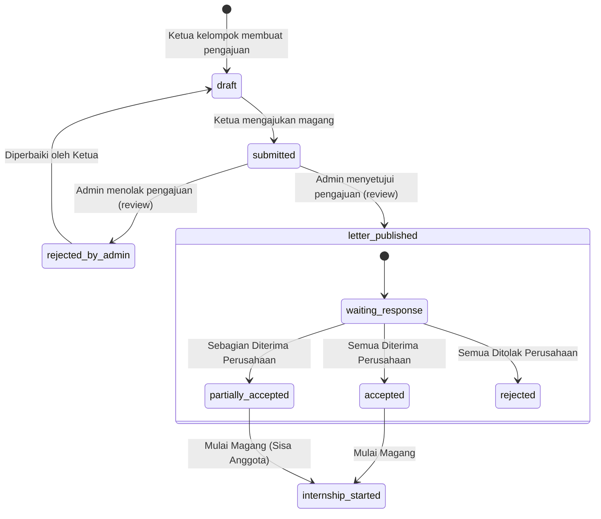

# Submission State Machine

Dokumen ini mendefinisikan status (*state*) pengajuan magang (`internship_submissions`) dan transisi status yang berlaku di MagangHub.

---

# Siklus Hidup Pengajuan Magang

Status pengajuan magang disimpan pada kolom `status` di tabel `internship_submissions` dengan nilai-nilai sebagai berikut:

---

# Detail Status dan Transisi

### 1. `draft` (Draf)
* **Deskripsi**: Data pengajuan magang sedang diisi oleh Ketua kelompok.
* **Transisi**:
  - `draft` → `submitted` (Saat Ketua menekan tombol ajukan dan validasi kolom wajib terpenuhi).

### 2. `submitted` (Diajukan)
* **Deskripsi**: Pengajuan sedang berada dalam antrean peninjauan oleh Administrator atau Operator. Data pengajuan dan keanggotaan dikunci.
* **Transisi**:
  - `submitted` → `rejected_by_admin` (Jika Admin menolak karena ketidaksesuaian berkas/data).
  - `submitted` → `letter_published` (Jika Admin menyetujui data pengajuan).

### 3. `rejected_by_admin` (Ditolak Admin)
* **Deskripsi**: Pengajuan ditolak oleh Admin saat proses review. Catatan penolakan dimasukkan oleh Admin.
* **Transisi**:
  - `rejected_by_admin` → `draft` (Otomatis saat kelompok kembali ke status `forming` agar Ketua dapat mengedit ulang data pengajuan).

### 4. `letter_published` (Surat Permohonan Terbit)
* **Deskripsi**: Surat permohonan resmi telah terbit. Tahap ini juga mencakup masa tunggu respons perusahaan (*waiting response*).
* **Transisi**:
  - `letter_published` → `accepted` (Jika seluruh anggota diterima magang oleh perusahaan).
  - `letter_published` → `partially_accepted` (Jika sebagian anggota diterima).
  - `letter_published` → `rejected` (Jika seluruh anggota ditolak oleh perusahaan).

### 5. `accepted` (Diterima Perusahaan)
* **Deskripsi**: Seluruh anggota kelompok diterima secara resmi oleh perusahaan.
* **Transisi**:
  - `accepted` → `internship_started` (Kelompok resmi memulai magang).

### 6. `partially_accepted` (Diterima Sebagian Perusahaan)
* **Deskripsi**: Sebagian anggota kelompok diterima, sedangkan sebagian lainnya ditolak.
* **Tindakan**:
  - Anggota yang ditolak otomatis dikeluarkan dari kelompok.
  - Jika ketua kelompok ditolak, ketua baru harus dipilih dari anggota yang diterima.
* **Transisi**:
  - `partially_accepted` → `internship_started` (Sisa anggota yang diterima resmi memulai magang).

### 7. `rejected` (Ditolak Perusahaan)
* **Deskripsi**: Seluruh anggota kelompok ditolak secara resmi oleh perusahaan.
* **Tindakan**:
  - Jabatan Ketua dicabut (menjadi anggota biasa) agar mantan Ketua bisa bergabung/membuat kelompok baru.
  - Data pengajuan disimpan sebagai catatan histori.

### 8. `internship_started` (Magang Dimulai)
* **Deskripsi**: Kelompok atau sisa anggota yang diterima telah resmi ditempatkan dan memulai aktivitas magang mereka.

---

# Aturan Invariant Pengajuan

1. **Satu Pengajuan Aktif**: Setiap kelompok magang hanya boleh memiliki satu pengajuan magang aktif (status non-final seperti `draft`, `submitted`, `letter_published`) dalam satu waktu.
2. **Snapshot Keanggotaan**: Pada saat pengajuan berpindah status ke `submitted`, daftar anggota kelompok disalin ke tabel snapshot `submission_memberships` untuk mencatat siapa saja anggota yang diajukan.
3. **Histori Penolakan**: Ketika pengajuan ditolak baik oleh admin (`rejected_by_admin`) maupun perusahaan (`rejected`), data pengajuan tersebut **tidak dihapus** melainkan statusnya diperbarui untuk kebutuhan pelaporan histori magang mahasiswa.