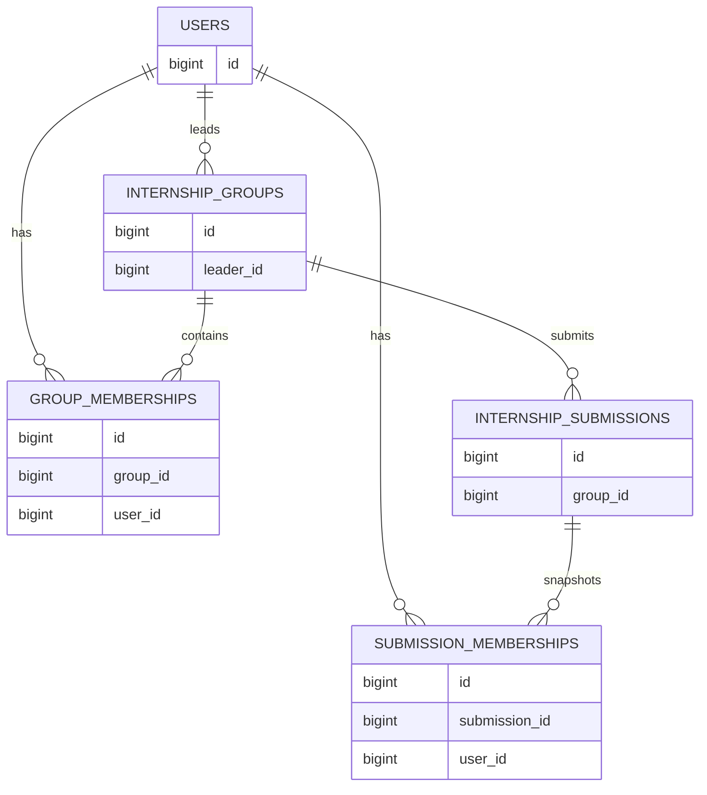

# ERD v1

Dokumen ini mendefinisikan entitas dan relasi utama sistem MagangHub.

ERD ini hanya memuat struktur tingkat tinggi dan belum mendefinisikan seluruh kolom.

## Entitas

### User

Merepresentasikan mahasiswa, operator, dan administrator.

Relasi:

* User memiliki banyak GroupMembership.
* User memiliki banyak SubmissionMembership.
* User dapat menjadi ketua dari banyak InternshipGroup.

---

### InternshipGroup

Merepresentasikan kelompok magang.

Relasi:

* InternshipGroup memiliki satu ketua.
* InternshipGroup memiliki banyak GroupMembership.
* InternshipGroup memiliki banyak InternshipSubmission.

---

### GroupMembership

Merepresentasikan anggota kelompok yang aktif saat ini.

Relasi:

* GroupMembership dimiliki oleh satu User.
* GroupMembership dimiliki oleh satu InternshipGroup.

---

### InternshipSubmission

Merepresentasikan satu pengajuan magang ke suatu perusahaan.

Satu kelompok dapat memiliki banyak pengajuan sepanjang hidup kelompok.

Relasi:

* InternshipSubmission dimiliki oleh satu InternshipGroup.
* InternshipSubmission memiliki banyak SubmissionMembership.

---

### SubmissionMembership

Snapshot anggota kelompok ketika pengajuan dilakukan.

Relasi:

* SubmissionMembership dimiliki oleh satu InternshipSubmission.
* SubmissionMembership dimiliki oleh satu User.

---

## Diagram Mermaid

## Catatan

* GroupMembership merepresentasikan kondisi kelompok saat ini.
* SubmissionMembership merepresentasikan histori anggota ketika pengajuan dilakukan.
* Satu kelompok dapat memiliki banyak pengajuan.
* Anggota kelompok dapat berubah setelah suatu pengajuan ditolak.
* Detail status dan enum akan ditentukan pada implementasi.
* Mekanisme penerimaan sebagian anggota masih akan ditentukan kemudian.
* Entitas Internship belum didefinisikan pada ERD v1.
